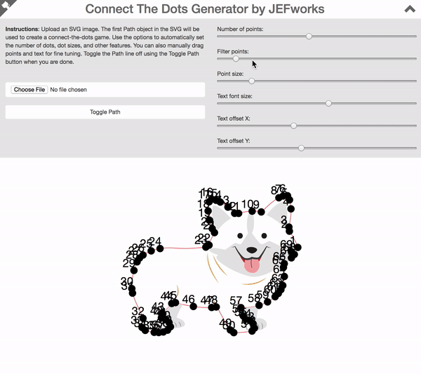

# Connect The Dots Generator

Given an SVG, the first Path object ill be used to create a connect-the-dots game. Use options to automatically set the desired number of dots, dot sizes, and other features. You can also manually drag points and text for fine tuning. Toggle the Path line off using the Toggle Path button when you are done for a printable custom connect the dots game. 
	

	
**[Try it out online ☞ Connect The Dots Generator](http://jef.works/Connect-The-Dots-Generator/)**
		
	
	
		
